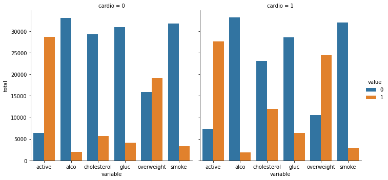
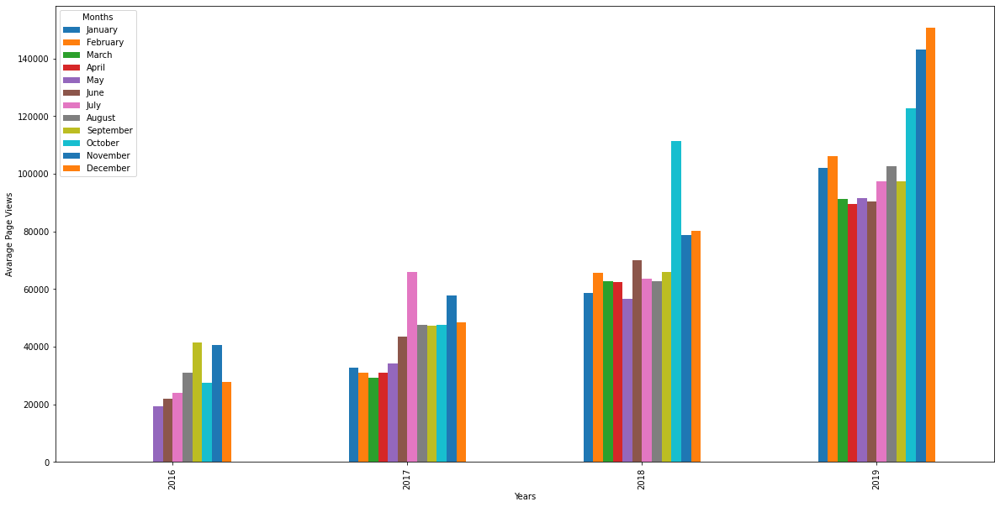
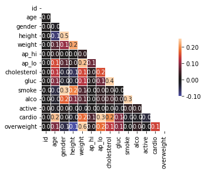

# Medical Data Visualizer Walkthrough

### Import modules


```python
import pandas as pd
import seaborn as sns
import numpy as np
import matplotlib.pyplot as plt
```

### Read CSV file into Dataframe


```python
df = pd.read_csv("medical_examination.csv")
df
```


<div>
<style scoped>
    .dataframe tbody tr th:only-of-type {
        vertical-align: middle;
    }

    .dataframe tbody tr th {
        vertical-align: top;
    }

    .dataframe thead th {
        text-align: right;
    }
</style>
<table border="1" class="dataframe">
  <thead>
    <tr style="text-align: right;">
      <th></th>
      <th>id</th>
      <th>age</th>
      <th>gender</th>
      <th>height</th>
      <th>weight</th>
      <th>ap_hi</th>
      <th>ap_lo</th>
      <th>cholesterol</th>
      <th>gluc</th>
      <th>smoke</th>
      <th>alco</th>
      <th>active</th>
      <th>cardio</th>
    </tr>
  </thead>
  <tbody>
    <tr>
      <th>0</th>
      <td>0</td>
      <td>18393</td>
      <td>2</td>
      <td>168</td>
      <td>62.0</td>
      <td>110</td>
      <td>80</td>
      <td>1</td>
      <td>1</td>
      <td>0</td>
      <td>0</td>
      <td>1</td>
      <td>0</td>
    </tr>
    <tr>
      <th>1</th>
      <td>1</td>
      <td>20228</td>
      <td>1</td>
      <td>156</td>
      <td>85.0</td>
      <td>140</td>
      <td>90</td>
      <td>3</td>
      <td>1</td>
      <td>0</td>
      <td>0</td>
      <td>1</td>
      <td>1</td>
    </tr>
    <tr>
      <th>2</th>
      <td>2</td>
      <td>18857</td>
      <td>1</td>
      <td>165</td>
      <td>64.0</td>
      <td>130</td>
      <td>70</td>
      <td>3</td>
      <td>1</td>
      <td>0</td>
      <td>0</td>
      <td>0</td>
      <td>1</td>
    </tr>
    <tr>
      <th>3</th>
      <td>3</td>
      <td>17623</td>
      <td>2</td>
      <td>169</td>
      <td>82.0</td>
      <td>150</td>
      <td>100</td>
      <td>1</td>
      <td>1</td>
      <td>0</td>
      <td>0</td>
      <td>1</td>
      <td>1</td>
    </tr>
    <tr>
      <th>4</th>
      <td>4</td>
      <td>17474</td>
      <td>1</td>
      <td>156</td>
      <td>56.0</td>
      <td>100</td>
      <td>60</td>
      <td>1</td>
      <td>1</td>
      <td>0</td>
      <td>0</td>
      <td>0</td>
      <td>0</td>
    </tr>
    <tr>
      <th>...</th>
      <td>...</td>
      <td>...</td>
      <td>...</td>
      <td>...</td>
      <td>...</td>
      <td>...</td>
      <td>...</td>
      <td>...</td>
      <td>...</td>
      <td>...</td>
      <td>...</td>
      <td>...</td>
      <td>...</td>
    </tr>
    <tr>
      <th>69995</th>
      <td>99993</td>
      <td>19240</td>
      <td>2</td>
      <td>168</td>
      <td>76.0</td>
      <td>120</td>
      <td>80</td>
      <td>1</td>
      <td>1</td>
      <td>1</td>
      <td>0</td>
      <td>1</td>
      <td>0</td>
    </tr>
    <tr>
      <th>69996</th>
      <td>99995</td>
      <td>22601</td>
      <td>1</td>
      <td>158</td>
      <td>126.0</td>
      <td>140</td>
      <td>90</td>
      <td>2</td>
      <td>2</td>
      <td>0</td>
      <td>0</td>
      <td>1</td>
      <td>1</td>
    </tr>
    <tr>
      <th>69997</th>
      <td>99996</td>
      <td>19066</td>
      <td>2</td>
      <td>183</td>
      <td>105.0</td>
      <td>180</td>
      <td>90</td>
      <td>3</td>
      <td>1</td>
      <td>0</td>
      <td>1</td>
      <td>0</td>
      <td>1</td>
    </tr>
    <tr>
      <th>69998</th>
      <td>99998</td>
      <td>22431</td>
      <td>1</td>
      <td>163</td>
      <td>72.0</td>
      <td>135</td>
      <td>80</td>
      <td>1</td>
      <td>2</td>
      <td>0</td>
      <td>0</td>
      <td>0</td>
      <td>1</td>
    </tr>
    <tr>
      <th>69999</th>
      <td>99999</td>
      <td>20540</td>
      <td>1</td>
      <td>170</td>
      <td>72.0</td>
      <td>120</td>
      <td>80</td>
      <td>2</td>
      <td>1</td>
      <td>0</td>
      <td>0</td>
      <td>1</td>
      <td>0</td>
    </tr>
  </tbody>
</table>
<p>70000 rows × 13 columns</p>
</div>


### Add Overweight column (BMI = weight(kg) / (length(m))^2)


```python
df["overweight"] = df["weight"]/(df["height"]/100)**2
df
```


<div>
<style scoped>
    .dataframe tbody tr th:only-of-type {
        vertical-align: middle;
    }

    .dataframe tbody tr th {
        vertical-align: top;
    }

    .dataframe thead th {
        text-align: right;
    }
</style>
<table border="1" class="dataframe">
  <thead>
    <tr style="text-align: right;">
      <th></th>
      <th>id</th>
      <th>age</th>
      <th>gender</th>
      <th>height</th>
      <th>weight</th>
      <th>ap_hi</th>
      <th>ap_lo</th>
      <th>cholesterol</th>
      <th>gluc</th>
      <th>smoke</th>
      <th>alco</th>
      <th>active</th>
      <th>cardio</th>
      <th>overweight</th>
    </tr>
  </thead>
  <tbody>
    <tr>
      <th>0</th>
      <td>0</td>
      <td>18393</td>
      <td>2</td>
      <td>168</td>
      <td>62.0</td>
      <td>110</td>
      <td>80</td>
      <td>1</td>
      <td>1</td>
      <td>0</td>
      <td>0</td>
      <td>1</td>
      <td>0</td>
      <td>21.967120</td>
    </tr>
    <tr>
      <th>1</th>
      <td>1</td>
      <td>20228</td>
      <td>1</td>
      <td>156</td>
      <td>85.0</td>
      <td>140</td>
      <td>90</td>
      <td>3</td>
      <td>1</td>
      <td>0</td>
      <td>0</td>
      <td>1</td>
      <td>1</td>
      <td>34.927679</td>
    </tr>
    <tr>
      <th>2</th>
      <td>2</td>
      <td>18857</td>
      <td>1</td>
      <td>165</td>
      <td>64.0</td>
      <td>130</td>
      <td>70</td>
      <td>3</td>
      <td>1</td>
      <td>0</td>
      <td>0</td>
      <td>0</td>
      <td>1</td>
      <td>23.507805</td>
    </tr>
    <tr>
      <th>3</th>
      <td>3</td>
      <td>17623</td>
      <td>2</td>
      <td>169</td>
      <td>82.0</td>
      <td>150</td>
      <td>100</td>
      <td>1</td>
      <td>1</td>
      <td>0</td>
      <td>0</td>
      <td>1</td>
      <td>1</td>
      <td>28.710479</td>
    </tr>
    <tr>
      <th>4</th>
      <td>4</td>
      <td>17474</td>
      <td>1</td>
      <td>156</td>
      <td>56.0</td>
      <td>100</td>
      <td>60</td>
      <td>1</td>
      <td>1</td>
      <td>0</td>
      <td>0</td>
      <td>0</td>
      <td>0</td>
      <td>23.011177</td>
    </tr>
    <tr>
      <th>...</th>
      <td>...</td>
      <td>...</td>
      <td>...</td>
      <td>...</td>
      <td>...</td>
      <td>...</td>
      <td>...</td>
      <td>...</td>
      <td>...</td>
      <td>...</td>
      <td>...</td>
      <td>...</td>
      <td>...</td>
      <td>...</td>
    </tr>
    <tr>
      <th>69995</th>
      <td>99993</td>
      <td>19240</td>
      <td>2</td>
      <td>168</td>
      <td>76.0</td>
      <td>120</td>
      <td>80</td>
      <td>1</td>
      <td>1</td>
      <td>1</td>
      <td>0</td>
      <td>1</td>
      <td>0</td>
      <td>26.927438</td>
    </tr>
    <tr>
      <th>69996</th>
      <td>99995</td>
      <td>22601</td>
      <td>1</td>
      <td>158</td>
      <td>126.0</td>
      <td>140</td>
      <td>90</td>
      <td>2</td>
      <td>2</td>
      <td>0</td>
      <td>0</td>
      <td>1</td>
      <td>1</td>
      <td>50.472681</td>
    </tr>
    <tr>
      <th>69997</th>
      <td>99996</td>
      <td>19066</td>
      <td>2</td>
      <td>183</td>
      <td>105.0</td>
      <td>180</td>
      <td>90</td>
      <td>3</td>
      <td>1</td>
      <td>0</td>
      <td>1</td>
      <td>0</td>
      <td>1</td>
      <td>31.353579</td>
    </tr>
    <tr>
      <th>69998</th>
      <td>99998</td>
      <td>22431</td>
      <td>1</td>
      <td>163</td>
      <td>72.0</td>
      <td>135</td>
      <td>80</td>
      <td>1</td>
      <td>2</td>
      <td>0</td>
      <td>0</td>
      <td>0</td>
      <td>1</td>
      <td>27.099251</td>
    </tr>
    <tr>
      <th>69999</th>
      <td>99999</td>
      <td>20540</td>
      <td>1</td>
      <td>170</td>
      <td>72.0</td>
      <td>120</td>
      <td>80</td>
      <td>2</td>
      <td>1</td>
      <td>0</td>
      <td>0</td>
      <td>1</td>
      <td>0</td>
      <td>24.913495</td>
    </tr>
  </tbody>
</table>
<p>70000 rows × 14 columns</p>
</div>


#### If BMI > 25 set Overweight to 1, else set Overweight to 0


```python
df["overweight"] = np.where(df["overweight"] > 25.0, 1, 0)
df
# np.where(condition, value if true, value if false)
```


<div>
<style scoped>
    .dataframe tbody tr th:only-of-type {
        vertical-align: middle;
    }

    .dataframe tbody tr th {
        vertical-align: top;
    }

    .dataframe thead th {
        text-align: right;
    }
</style>
<table border="1" class="dataframe">
  <thead>
    <tr style="text-align: right;">
      <th></th>
      <th>id</th>
      <th>age</th>
      <th>gender</th>
      <th>height</th>
      <th>weight</th>
      <th>ap_hi</th>
      <th>ap_lo</th>
      <th>cholesterol</th>
      <th>gluc</th>
      <th>smoke</th>
      <th>alco</th>
      <th>active</th>
      <th>cardio</th>
      <th>overweight</th>
    </tr>
  </thead>
  <tbody>
    <tr>
      <th>0</th>
      <td>0</td>
      <td>18393</td>
      <td>2</td>
      <td>168</td>
      <td>62.0</td>
      <td>110</td>
      <td>80</td>
      <td>1</td>
      <td>1</td>
      <td>0</td>
      <td>0</td>
      <td>1</td>
      <td>0</td>
      <td>0</td>
    </tr>
    <tr>
      <th>1</th>
      <td>1</td>
      <td>20228</td>
      <td>1</td>
      <td>156</td>
      <td>85.0</td>
      <td>140</td>
      <td>90</td>
      <td>3</td>
      <td>1</td>
      <td>0</td>
      <td>0</td>
      <td>1</td>
      <td>1</td>
      <td>1</td>
    </tr>
    <tr>
      <th>2</th>
      <td>2</td>
      <td>18857</td>
      <td>1</td>
      <td>165</td>
      <td>64.0</td>
      <td>130</td>
      <td>70</td>
      <td>3</td>
      <td>1</td>
      <td>0</td>
      <td>0</td>
      <td>0</td>
      <td>1</td>
      <td>0</td>
    </tr>
    <tr>
      <th>3</th>
      <td>3</td>
      <td>17623</td>
      <td>2</td>
      <td>169</td>
      <td>82.0</td>
      <td>150</td>
      <td>100</td>
      <td>1</td>
      <td>1</td>
      <td>0</td>
      <td>0</td>
      <td>1</td>
      <td>1</td>
      <td>1</td>
    </tr>
    <tr>
      <th>4</th>
      <td>4</td>
      <td>17474</td>
      <td>1</td>
      <td>156</td>
      <td>56.0</td>
      <td>100</td>
      <td>60</td>
      <td>1</td>
      <td>1</td>
      <td>0</td>
      <td>0</td>
      <td>0</td>
      <td>0</td>
      <td>0</td>
    </tr>
    <tr>
      <th>...</th>
      <td>...</td>
      <td>...</td>
      <td>...</td>
      <td>...</td>
      <td>...</td>
      <td>...</td>
      <td>...</td>
      <td>...</td>
      <td>...</td>
      <td>...</td>
      <td>...</td>
      <td>...</td>
      <td>...</td>
      <td>...</td>
    </tr>
    <tr>
      <th>69995</th>
      <td>99993</td>
      <td>19240</td>
      <td>2</td>
      <td>168</td>
      <td>76.0</td>
      <td>120</td>
      <td>80</td>
      <td>1</td>
      <td>1</td>
      <td>1</td>
      <td>0</td>
      <td>1</td>
      <td>0</td>
      <td>1</td>
    </tr>
    <tr>
      <th>69996</th>
      <td>99995</td>
      <td>22601</td>
      <td>1</td>
      <td>158</td>
      <td>126.0</td>
      <td>140</td>
      <td>90</td>
      <td>2</td>
      <td>2</td>
      <td>0</td>
      <td>0</td>
      <td>1</td>
      <td>1</td>
      <td>1</td>
    </tr>
    <tr>
      <th>69997</th>
      <td>99996</td>
      <td>19066</td>
      <td>2</td>
      <td>183</td>
      <td>105.0</td>
      <td>180</td>
      <td>90</td>
      <td>3</td>
      <td>1</td>
      <td>0</td>
      <td>1</td>
      <td>0</td>
      <td>1</td>
      <td>1</td>
    </tr>
    <tr>
      <th>69998</th>
      <td>99998</td>
      <td>22431</td>
      <td>1</td>
      <td>163</td>
      <td>72.0</td>
      <td>135</td>
      <td>80</td>
      <td>1</td>
      <td>2</td>
      <td>0</td>
      <td>0</td>
      <td>0</td>
      <td>1</td>
      <td>1</td>
    </tr>
    <tr>
      <th>69999</th>
      <td>99999</td>
      <td>20540</td>
      <td>1</td>
      <td>170</td>
      <td>72.0</td>
      <td>120</td>
      <td>80</td>
      <td>2</td>
      <td>1</td>
      <td>0</td>
      <td>0</td>
      <td>1</td>
      <td>0</td>
      <td>0</td>
    </tr>
  </tbody>
</table>
<p>70000 rows × 14 columns</p>
</div>


### Normalize the data by making 0 always good and 1 always bad
#### *cholesterol or gluc = 1 is good (0) , cholesterol or gluc > 1 is bad (1)*


```python
df["cholesterol"] = np.where(df["cholesterol"] > 1.0, 1, 0)
df["gluc"] = np.where(df["gluc"] > 1.0, 1, 0)
df
```


<div>
<style scoped>
    .dataframe tbody tr th:only-of-type {
        vertical-align: middle;
    }

    .dataframe tbody tr th {
        vertical-align: top;
    }

    .dataframe thead th {
        text-align: right;
    }
</style>
<table border="1" class="dataframe">
  <thead>
    <tr style="text-align: right;">
      <th></th>
      <th>id</th>
      <th>age</th>
      <th>gender</th>
      <th>height</th>
      <th>weight</th>
      <th>ap_hi</th>
      <th>ap_lo</th>
      <th>cholesterol</th>
      <th>gluc</th>
      <th>smoke</th>
      <th>alco</th>
      <th>active</th>
      <th>cardio</th>
      <th>overweight</th>
    </tr>
  </thead>
  <tbody>
    <tr>
      <th>0</th>
      <td>0</td>
      <td>18393</td>
      <td>2</td>
      <td>168</td>
      <td>62.0</td>
      <td>110</td>
      <td>80</td>
      <td>0</td>
      <td>0</td>
      <td>0</td>
      <td>0</td>
      <td>1</td>
      <td>0</td>
      <td>0</td>
    </tr>
    <tr>
      <th>1</th>
      <td>1</td>
      <td>20228</td>
      <td>1</td>
      <td>156</td>
      <td>85.0</td>
      <td>140</td>
      <td>90</td>
      <td>1</td>
      <td>0</td>
      <td>0</td>
      <td>0</td>
      <td>1</td>
      <td>1</td>
      <td>1</td>
    </tr>
    <tr>
      <th>2</th>
      <td>2</td>
      <td>18857</td>
      <td>1</td>
      <td>165</td>
      <td>64.0</td>
      <td>130</td>
      <td>70</td>
      <td>1</td>
      <td>0</td>
      <td>0</td>
      <td>0</td>
      <td>0</td>
      <td>1</td>
      <td>0</td>
    </tr>
    <tr>
      <th>3</th>
      <td>3</td>
      <td>17623</td>
      <td>2</td>
      <td>169</td>
      <td>82.0</td>
      <td>150</td>
      <td>100</td>
      <td>0</td>
      <td>0</td>
      <td>0</td>
      <td>0</td>
      <td>1</td>
      <td>1</td>
      <td>1</td>
    </tr>
    <tr>
      <th>4</th>
      <td>4</td>
      <td>17474</td>
      <td>1</td>
      <td>156</td>
      <td>56.0</td>
      <td>100</td>
      <td>60</td>
      <td>0</td>
      <td>0</td>
      <td>0</td>
      <td>0</td>
      <td>0</td>
      <td>0</td>
      <td>0</td>
    </tr>
    <tr>
      <th>...</th>
      <td>...</td>
      <td>...</td>
      <td>...</td>
      <td>...</td>
      <td>...</td>
      <td>...</td>
      <td>...</td>
      <td>...</td>
      <td>...</td>
      <td>...</td>
      <td>...</td>
      <td>...</td>
      <td>...</td>
      <td>...</td>
    </tr>
    <tr>
      <th>69995</th>
      <td>99993</td>
      <td>19240</td>
      <td>2</td>
      <td>168</td>
      <td>76.0</td>
      <td>120</td>
      <td>80</td>
      <td>0</td>
      <td>0</td>
      <td>1</td>
      <td>0</td>
      <td>1</td>
      <td>0</td>
      <td>1</td>
    </tr>
    <tr>
      <th>69996</th>
      <td>99995</td>
      <td>22601</td>
      <td>1</td>
      <td>158</td>
      <td>126.0</td>
      <td>140</td>
      <td>90</td>
      <td>1</td>
      <td>1</td>
      <td>0</td>
      <td>0</td>
      <td>1</td>
      <td>1</td>
      <td>1</td>
    </tr>
    <tr>
      <th>69997</th>
      <td>99996</td>
      <td>19066</td>
      <td>2</td>
      <td>183</td>
      <td>105.0</td>
      <td>180</td>
      <td>90</td>
      <td>1</td>
      <td>0</td>
      <td>0</td>
      <td>1</td>
      <td>0</td>
      <td>1</td>
      <td>1</td>
    </tr>
    <tr>
      <th>69998</th>
      <td>99998</td>
      <td>22431</td>
      <td>1</td>
      <td>163</td>
      <td>72.0</td>
      <td>135</td>
      <td>80</td>
      <td>0</td>
      <td>1</td>
      <td>0</td>
      <td>0</td>
      <td>0</td>
      <td>1</td>
      <td>1</td>
    </tr>
    <tr>
      <th>69999</th>
      <td>99999</td>
      <td>20540</td>
      <td>1</td>
      <td>170</td>
      <td>72.0</td>
      <td>120</td>
      <td>80</td>
      <td>1</td>
      <td>0</td>
      <td>0</td>
      <td>0</td>
      <td>1</td>
      <td>0</td>
      <td>0</td>
    </tr>
  </tbody>
</table>
<p>70000 rows × 14 columns</p>
</div>


### Convert the data into long format and create a chart
#### Chart should show value counts of the categorical features using seaborn's catplot(). The dataset should be split by 'Cardio' so there is one chart for each cardio value.


```python
df_cat = pd.melt(df, id_vars="cardio", value_vars=["cholesterol", "gluc", "smoke", "alco", "active", "overweight"])
df_cat["total"] = 0
df_cat
```


<div>
<style scoped>
    .dataframe tbody tr th:only-of-type {
        vertical-align: middle;
    }

    .dataframe tbody tr th {
        vertical-align: top;
    }

    .dataframe thead th {
        text-align: right;
    }
</style>
<table border="1" class="dataframe">
  <thead>
    <tr style="text-align: right;">
      <th></th>
      <th>cardio</th>
      <th>variable</th>
      <th>value</th>
      <th>total</th>
    </tr>
  </thead>
  <tbody>
    <tr>
      <th>0</th>
      <td>0</td>
      <td>cholesterol</td>
      <td>0</td>
      <td>0</td>
    </tr>
    <tr>
      <th>1</th>
      <td>1</td>
      <td>cholesterol</td>
      <td>1</td>
      <td>0</td>
    </tr>
    <tr>
      <th>2</th>
      <td>1</td>
      <td>cholesterol</td>
      <td>1</td>
      <td>0</td>
    </tr>
    <tr>
      <th>3</th>
      <td>1</td>
      <td>cholesterol</td>
      <td>0</td>
      <td>0</td>
    </tr>
    <tr>
      <th>4</th>
      <td>0</td>
      <td>cholesterol</td>
      <td>0</td>
      <td>0</td>
    </tr>
    <tr>
      <th>...</th>
      <td>...</td>
      <td>...</td>
      <td>...</td>
      <td>...</td>
    </tr>
    <tr>
      <th>419995</th>
      <td>0</td>
      <td>overweight</td>
      <td>1</td>
      <td>0</td>
    </tr>
    <tr>
      <th>419996</th>
      <td>1</td>
      <td>overweight</td>
      <td>1</td>
      <td>0</td>
    </tr>
    <tr>
      <th>419997</th>
      <td>1</td>
      <td>overweight</td>
      <td>1</td>
      <td>0</td>
    </tr>
    <tr>
      <th>419998</th>
      <td>1</td>
      <td>overweight</td>
      <td>1</td>
      <td>0</td>
    </tr>
    <tr>
      <th>419999</th>
      <td>0</td>
      <td>overweight</td>
      <td>0</td>
      <td>0</td>
    </tr>
  </tbody>
</table>
<p>420000 rows × 4 columns</p>
</div>


### Group and reformat the data to split it by 'cardio'.


```python
df_cat = df_cat.groupby(["cardio", "variable", "value"]).count().reset_index()
df_cat
```


<div>
<style scoped>
    .dataframe tbody tr th:only-of-type {
        vertical-align: middle;
    }

    .dataframe tbody tr th {
        vertical-align: top;
    }

    .dataframe thead th {
        text-align: right;
    }
</style>
<table border="1" class="dataframe">
  <thead>
    <tr style="text-align: right;">
      <th></th>
      <th>cardio</th>
      <th>variable</th>
      <th>value</th>
      <th>total</th>
    </tr>
  </thead>
  <tbody>
    <tr>
      <th>0</th>
      <td>0</td>
      <td>active</td>
      <td>0</td>
      <td>6378</td>
    </tr>
    <tr>
      <th>1</th>
      <td>0</td>
      <td>active</td>
      <td>1</td>
      <td>28643</td>
    </tr>
    <tr>
      <th>2</th>
      <td>0</td>
      <td>alco</td>
      <td>0</td>
      <td>33080</td>
    </tr>
    <tr>
      <th>3</th>
      <td>0</td>
      <td>alco</td>
      <td>1</td>
      <td>1941</td>
    </tr>
    <tr>
      <th>4</th>
      <td>0</td>
      <td>cholesterol</td>
      <td>0</td>
      <td>29330</td>
    </tr>
    <tr>
      <th>5</th>
      <td>0</td>
      <td>cholesterol</td>
      <td>1</td>
      <td>5691</td>
    </tr>
    <tr>
      <th>6</th>
      <td>0</td>
      <td>gluc</td>
      <td>0</td>
      <td>30894</td>
    </tr>
    <tr>
      <th>7</th>
      <td>0</td>
      <td>gluc</td>
      <td>1</td>
      <td>4127</td>
    </tr>
    <tr>
      <th>8</th>
      <td>0</td>
      <td>overweight</td>
      <td>0</td>
      <td>15915</td>
    </tr>
    <tr>
      <th>9</th>
      <td>0</td>
      <td>overweight</td>
      <td>1</td>
      <td>19106</td>
    </tr>
    <tr>
      <th>10</th>
      <td>0</td>
      <td>smoke</td>
      <td>0</td>
      <td>31781</td>
    </tr>
    <tr>
      <th>11</th>
      <td>0</td>
      <td>smoke</td>
      <td>1</td>
      <td>3240</td>
    </tr>
    <tr>
      <th>12</th>
      <td>1</td>
      <td>active</td>
      <td>0</td>
      <td>7361</td>
    </tr>
    <tr>
      <th>13</th>
      <td>1</td>
      <td>active</td>
      <td>1</td>
      <td>27618</td>
    </tr>
    <tr>
      <th>14</th>
      <td>1</td>
      <td>alco</td>
      <td>0</td>
      <td>33156</td>
    </tr>
    <tr>
      <th>15</th>
      <td>1</td>
      <td>alco</td>
      <td>1</td>
      <td>1823</td>
    </tr>
    <tr>
      <th>16</th>
      <td>1</td>
      <td>cholesterol</td>
      <td>0</td>
      <td>23055</td>
    </tr>
    <tr>
      <th>17</th>
      <td>1</td>
      <td>cholesterol</td>
      <td>1</td>
      <td>11924</td>
    </tr>
    <tr>
      <th>18</th>
      <td>1</td>
      <td>gluc</td>
      <td>0</td>
      <td>28585</td>
    </tr>
    <tr>
      <th>19</th>
      <td>1</td>
      <td>gluc</td>
      <td>1</td>
      <td>6394</td>
    </tr>
    <tr>
      <th>20</th>
      <td>1</td>
      <td>overweight</td>
      <td>0</td>
      <td>10539</td>
    </tr>
    <tr>
      <th>21</th>
      <td>1</td>
      <td>overweight</td>
      <td>1</td>
      <td>24440</td>
    </tr>
    <tr>
      <th>22</th>
      <td>1</td>
      <td>smoke</td>
      <td>0</td>
      <td>32050</td>
    </tr>
    <tr>
      <th>23</th>
      <td>1</td>
      <td>smoke</td>
      <td>1</td>
      <td>2929</td>
    </tr>
  </tbody>
</table>
</div>


```python
bar = sns.catplot(x="variable", y="total", hue="value", col="cardio", data=df_cat, kind="bar")
fig = bar.fig
```


    

    


#### Save file


```python
fig.savefig("catplot.png")
```

### Clean the Data
#### Filter out the following patient segments that represent incorrect data


```python
df_heat = df[
   (df["ap_lo"] <= df["ap_hi"]) & 
   (df["height"] >= (df["height"].quantile(0.025))) &
   (df["height"] <= (df["height"].quantile(0.975))) &
   (df["weight"] >= (df["weight"].quantile(0.025))) &
   (df["weight"] <= (df["weight"].quantile(0.975)))
   ]
df_heat
```


<div>
<style scoped>
    .dataframe tbody tr th:only-of-type {
        vertical-align: middle;
    }

    .dataframe tbody tr th {
        vertical-align: top;
    }

    .dataframe thead th {
        text-align: right;
    }
</style>
<table border="1" class="dataframe">
  <thead>
    <tr style="text-align: right;">
      <th></th>
      <th>id</th>
      <th>age</th>
      <th>gender</th>
      <th>height</th>
      <th>weight</th>
      <th>ap_hi</th>
      <th>ap_lo</th>
      <th>cholesterol</th>
      <th>gluc</th>
      <th>smoke</th>
      <th>alco</th>
      <th>active</th>
      <th>cardio</th>
      <th>overweight</th>
    </tr>
  </thead>
  <tbody>
    <tr>
      <th>0</th>
      <td>0</td>
      <td>18393</td>
      <td>2</td>
      <td>168</td>
      <td>62.0</td>
      <td>110</td>
      <td>80</td>
      <td>0</td>
      <td>0</td>
      <td>0</td>
      <td>0</td>
      <td>1</td>
      <td>0</td>
      <td>0</td>
    </tr>
    <tr>
      <th>1</th>
      <td>1</td>
      <td>20228</td>
      <td>1</td>
      <td>156</td>
      <td>85.0</td>
      <td>140</td>
      <td>90</td>
      <td>1</td>
      <td>0</td>
      <td>0</td>
      <td>0</td>
      <td>1</td>
      <td>1</td>
      <td>1</td>
    </tr>
    <tr>
      <th>2</th>
      <td>2</td>
      <td>18857</td>
      <td>1</td>
      <td>165</td>
      <td>64.0</td>
      <td>130</td>
      <td>70</td>
      <td>1</td>
      <td>0</td>
      <td>0</td>
      <td>0</td>
      <td>0</td>
      <td>1</td>
      <td>0</td>
    </tr>
    <tr>
      <th>3</th>
      <td>3</td>
      <td>17623</td>
      <td>2</td>
      <td>169</td>
      <td>82.0</td>
      <td>150</td>
      <td>100</td>
      <td>0</td>
      <td>0</td>
      <td>0</td>
      <td>0</td>
      <td>1</td>
      <td>1</td>
      <td>1</td>
    </tr>
    <tr>
      <th>4</th>
      <td>4</td>
      <td>17474</td>
      <td>1</td>
      <td>156</td>
      <td>56.0</td>
      <td>100</td>
      <td>60</td>
      <td>0</td>
      <td>0</td>
      <td>0</td>
      <td>0</td>
      <td>0</td>
      <td>0</td>
      <td>0</td>
    </tr>
    <tr>
      <th>...</th>
      <td>...</td>
      <td>...</td>
      <td>...</td>
      <td>...</td>
      <td>...</td>
      <td>...</td>
      <td>...</td>
      <td>...</td>
      <td>...</td>
      <td>...</td>
      <td>...</td>
      <td>...</td>
      <td>...</td>
      <td>...</td>
    </tr>
    <tr>
      <th>69993</th>
      <td>99991</td>
      <td>19699</td>
      <td>1</td>
      <td>172</td>
      <td>70.0</td>
      <td>130</td>
      <td>90</td>
      <td>0</td>
      <td>0</td>
      <td>0</td>
      <td>0</td>
      <td>1</td>
      <td>1</td>
      <td>0</td>
    </tr>
    <tr>
      <th>69994</th>
      <td>99992</td>
      <td>21074</td>
      <td>1</td>
      <td>165</td>
      <td>80.0</td>
      <td>150</td>
      <td>80</td>
      <td>0</td>
      <td>0</td>
      <td>0</td>
      <td>0</td>
      <td>1</td>
      <td>1</td>
      <td>1</td>
    </tr>
    <tr>
      <th>69995</th>
      <td>99993</td>
      <td>19240</td>
      <td>2</td>
      <td>168</td>
      <td>76.0</td>
      <td>120</td>
      <td>80</td>
      <td>0</td>
      <td>0</td>
      <td>1</td>
      <td>0</td>
      <td>1</td>
      <td>0</td>
      <td>1</td>
    </tr>
    <tr>
      <th>69998</th>
      <td>99998</td>
      <td>22431</td>
      <td>1</td>
      <td>163</td>
      <td>72.0</td>
      <td>135</td>
      <td>80</td>
      <td>0</td>
      <td>1</td>
      <td>0</td>
      <td>0</td>
      <td>0</td>
      <td>1</td>
      <td>1</td>
    </tr>
    <tr>
      <th>69999</th>
      <td>99999</td>
      <td>20540</td>
      <td>1</td>
      <td>170</td>
      <td>72.0</td>
      <td>120</td>
      <td>80</td>
      <td>1</td>
      <td>0</td>
      <td>0</td>
      <td>0</td>
      <td>1</td>
      <td>0</td>
      <td>0</td>
    </tr>
  </tbody>
</table>
<p>63259 rows × 14 columns</p>
</div>


### Create a correlation matrix using the dataset. Plot the correlation matrix using seaborn's heatmap(). Mask the upper triangle.

Calculate the correlation matrix


```python
corr = df_heat.corr()
corr
```


<div>
<style scoped>
    .dataframe tbody tr th:only-of-type {
        vertical-align: middle;
    }

    .dataframe tbody tr th {
        vertical-align: top;
    }

    .dataframe thead th {
        text-align: right;
    }
</style>
<table border="1" class="dataframe">
  <thead>
    <tr style="text-align: right;">
      <th></th>
      <th>id</th>
      <th>age</th>
      <th>gender</th>
      <th>height</th>
      <th>weight</th>
      <th>ap_hi</th>
      <th>ap_lo</th>
      <th>cholesterol</th>
      <th>gluc</th>
      <th>smoke</th>
      <th>alco</th>
      <th>active</th>
      <th>cardio</th>
      <th>overweight</th>
    </tr>
  </thead>
  <tbody>
    <tr>
      <th>id</th>
      <td>1.000000</td>
      <td>0.002659</td>
      <td>0.004871</td>
      <td>0.003799</td>
      <td>0.001764</td>
      <td>0.002939</td>
      <td>0.001854</td>
      <td>0.005521</td>
      <td>0.004189</td>
      <td>-0.001606</td>
      <td>0.000014</td>
      <td>0.005014</td>
      <td>0.004009</td>
      <td>0.000285</td>
    </tr>
    <tr>
      <th>age</th>
      <td>0.002659</td>
      <td>1.000000</td>
      <td>-0.015467</td>
      <td>-0.074150</td>
      <td>0.062294</td>
      <td>0.020814</td>
      <td>0.149614</td>
      <td>0.128204</td>
      <td>0.088231</td>
      <td>-0.043902</td>
      <td>-0.026989</td>
      <td>-0.012025</td>
      <td>0.236088</td>
      <td>0.086693</td>
    </tr>
    <tr>
      <th>gender</th>
      <td>0.004871</td>
      <td>-0.015467</td>
      <td>1.000000</td>
      <td>0.501243</td>
      <td>0.102116</td>
      <td>0.003265</td>
      <td>0.059182</td>
      <td>-0.035928</td>
      <td>-0.020940</td>
      <td>0.336925</td>
      <td>0.167441</td>
      <td>0.008627</td>
      <td>0.004466</td>
      <td>-0.050355</td>
    </tr>
    <tr>
      <th>height</th>
      <td>0.003799</td>
      <td>-0.074150</td>
      <td>0.501243</td>
      <td>1.000000</td>
      <td>0.215769</td>
      <td>0.001823</td>
      <td>0.017882</td>
      <td>-0.057809</td>
      <td>-0.028525</td>
      <td>0.188042</td>
      <td>0.086819</td>
      <td>-0.003215</td>
      <td>-0.019508</td>
      <td>-0.144370</td>
    </tr>
    <tr>
      <th>weight</th>
      <td>0.001764</td>
      <td>0.062294</td>
      <td>0.102116</td>
      <td>0.215769</td>
      <td>1.000000</td>
      <td>0.028126</td>
      <td>0.234004</td>
      <td>0.145666</td>
      <td>0.123964</td>
      <td>0.052626</td>
      <td>0.058045</td>
      <td>-0.013243</td>
      <td>0.172739</td>
      <td>0.619227</td>
    </tr>
    <tr>
      <th>ap_hi</th>
      <td>0.002939</td>
      <td>0.020814</td>
      <td>0.003265</td>
      <td>0.001823</td>
      <td>0.028126</td>
      <td>1.000000</td>
      <td>0.075833</td>
      <td>0.025192</td>
      <td>0.012895</td>
      <td>-0.001540</td>
      <td>0.001302</td>
      <td>-0.001060</td>
      <td>0.051960</td>
      <td>0.020087</td>
    </tr>
    <tr>
      <th>ap_lo</th>
      <td>0.001854</td>
      <td>0.149614</td>
      <td>0.059182</td>
      <td>0.017882</td>
      <td>0.234004</td>
      <td>0.075833</td>
      <td>1.000000</td>
      <td>0.152496</td>
      <td>0.079811</td>
      <td>0.024221</td>
      <td>0.034213</td>
      <td>0.002111</td>
      <td>0.326566</td>
      <td>0.174486</td>
    </tr>
    <tr>
      <th>cholesterol</th>
      <td>0.005521</td>
      <td>0.128204</td>
      <td>-0.035928</td>
      <td>-0.057809</td>
      <td>0.145666</td>
      <td>0.025192</td>
      <td>0.152496</td>
      <td>1.000000</td>
      <td>0.386261</td>
      <td>0.014939</td>
      <td>0.040652</td>
      <td>0.000973</td>
      <td>0.203919</td>
      <td>0.130373</td>
    </tr>
    <tr>
      <th>gluc</th>
      <td>0.004189</td>
      <td>0.088231</td>
      <td>-0.020940</td>
      <td>-0.028525</td>
      <td>0.123964</td>
      <td>0.012895</td>
      <td>0.079811</td>
      <td>0.386261</td>
      <td>1.000000</td>
      <td>-0.001557</td>
      <td>0.017509</td>
      <td>-0.011939</td>
      <td>0.089600</td>
      <td>0.091627</td>
    </tr>
    <tr>
      <th>smoke</th>
      <td>-0.001606</td>
      <td>-0.043902</td>
      <td>0.336925</td>
      <td>0.188042</td>
      <td>0.052626</td>
      <td>-0.001540</td>
      <td>0.024221</td>
      <td>0.014939</td>
      <td>-0.001557</td>
      <td>1.000000</td>
      <td>0.337713</td>
      <td>0.024703</td>
      <td>-0.017859</td>
      <td>0.001591</td>
    </tr>
    <tr>
      <th>alco</th>
      <td>0.000014</td>
      <td>-0.026989</td>
      <td>0.167441</td>
      <td>0.086819</td>
      <td>0.058045</td>
      <td>0.001302</td>
      <td>0.034213</td>
      <td>0.040652</td>
      <td>0.017509</td>
      <td>0.337713</td>
      <td>1.000000</td>
      <td>0.025055</td>
      <td>-0.010177</td>
      <td>0.026959</td>
    </tr>
    <tr>
      <th>active</th>
      <td>0.005014</td>
      <td>-0.012025</td>
      <td>0.008627</td>
      <td>-0.003215</td>
      <td>-0.013243</td>
      <td>-0.001060</td>
      <td>0.002111</td>
      <td>0.000973</td>
      <td>-0.011939</td>
      <td>0.024703</td>
      <td>0.025055</td>
      <td>1.000000</td>
      <td>-0.037453</td>
      <td>-0.003517</td>
    </tr>
    <tr>
      <th>cardio</th>
      <td>0.004009</td>
      <td>0.236088</td>
      <td>0.004466</td>
      <td>-0.019508</td>
      <td>0.172739</td>
      <td>0.051960</td>
      <td>0.326566</td>
      <td>0.203919</td>
      <td>0.089600</td>
      <td>-0.017859</td>
      <td>-0.010177</td>
      <td>-0.037453</td>
      <td>1.000000</td>
      <td>0.144260</td>
    </tr>
    <tr>
      <th>overweight</th>
      <td>0.000285</td>
      <td>0.086693</td>
      <td>-0.050355</td>
      <td>-0.144370</td>
      <td>0.619227</td>
      <td>0.020087</td>
      <td>0.174486</td>
      <td>0.130373</td>
      <td>0.091627</td>
      <td>0.001591</td>
      <td>0.026959</td>
      <td>-0.003517</td>
      <td>0.144260</td>
      <td>1.000000</td>
    </tr>
  </tbody>
</table>
</div>


Generate a mask for the upper triangle


```python
mask = np.triu(corr)
```

Set up the matplotlib figure


```python
fig, ax = plt.subplots(figsize=(10,10))
```


    

    


Draw the heatmap with sns.heatmap()


```python
sns.heatmap(corr, linewidths=.5, annot=True, fmt=".1f", mask=mask, square=True, center=0, vmin=-0.1, vmax=0.25, cbar_kws={"shrink":.45, "format":"%.2f"})
```


    <AxesSubplot:>


    

    


```python
fig.savefig("heatmap.png")
```
