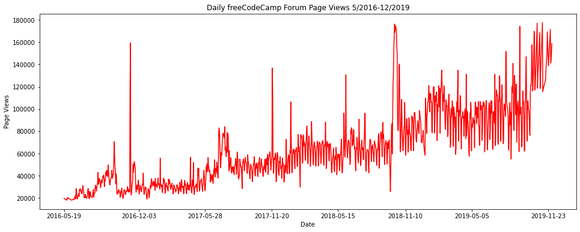
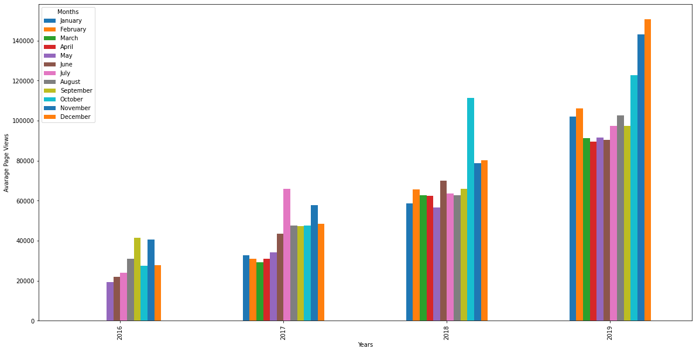
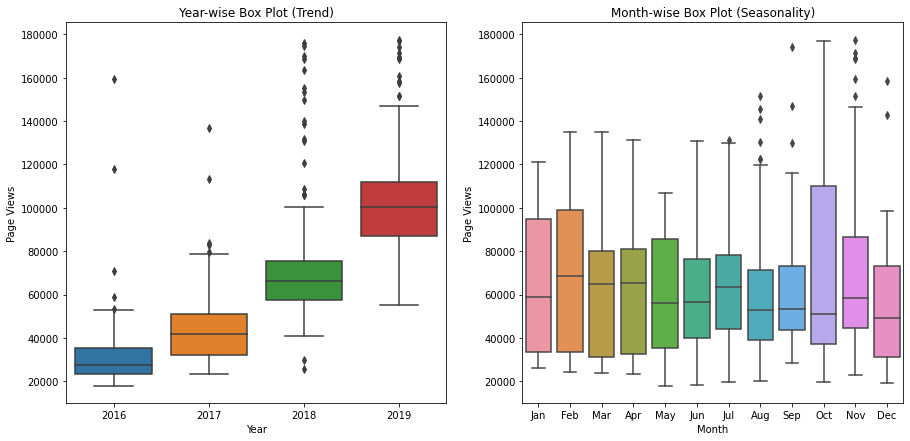

NOTE: This exercise was made in a hurry and some of the solutions could be  improved.

# Page View Time Series Visualizer Walkthrough

### Import Modules


```python
import matplotlib.pyplot as plt
import pandas as pd
import seaborn as sns
from pandas.plotting import register_matplotlib_converters
register_matplotlib_converters()
```

### Read Data into Dataframe


```python
df = pd.read_csv('fcc-forum-pageviews.csv', parse_dates = ["date"], index_col = "date")
df
```


<div>
<style scoped>
    .dataframe tbody tr th:only-of-type {
        vertical-align: middle;
    }

    .dataframe tbody tr th {
        vertical-align: top;
    }

    .dataframe thead th {
        text-align: right;
    }
</style>
<table border="1" class="dataframe">
  <thead>
    <tr style="text-align: right;">
      <th></th>
      <th>value</th>
    </tr>
    <tr>
      <th>date</th>
      <th></th>
    </tr>
  </thead>
  <tbody>
    <tr>
      <th>2016-05-09</th>
      <td>1201</td>
    </tr>
    <tr>
      <th>2016-05-10</th>
      <td>2329</td>
    </tr>
    <tr>
      <th>2016-05-11</th>
      <td>1716</td>
    </tr>
    <tr>
      <th>2016-05-12</th>
      <td>10539</td>
    </tr>
    <tr>
      <th>2016-05-13</th>
      <td>6933</td>
    </tr>
    <tr>
      <th>...</th>
      <td>...</td>
    </tr>
    <tr>
      <th>2019-11-29</th>
      <td>171584</td>
    </tr>
    <tr>
      <th>2019-11-30</th>
      <td>141161</td>
    </tr>
    <tr>
      <th>2019-12-01</th>
      <td>142918</td>
    </tr>
    <tr>
      <th>2019-12-02</th>
      <td>220144</td>
    </tr>
    <tr>
      <th>2019-12-03</th>
      <td>158549</td>
    </tr>
  </tbody>
</table>
<p>1304 rows × 1 columns</p>
</div>


### Clean the data 
#### Filter out days when the page views were in the top 2.5% of the dataset or bottom 2.5% of the dataset.


```python
df = df[(df["value"] >= (df["value"].quantile(0.025))) & (df["value"] <= (df["value"].quantile(0.975)))]
df
```


<div>
<style scoped>
    .dataframe tbody tr th:only-of-type {
        vertical-align: middle;
    }

    .dataframe tbody tr th {
        vertical-align: top;
    }

    .dataframe thead th {
        text-align: right;
    }
</style>
<table border="1" class="dataframe">
  <thead>
    <tr style="text-align: right;">
      <th></th>
      <th>value</th>
    </tr>
    <tr>
      <th>date</th>
      <th></th>
    </tr>
  </thead>
  <tbody>
    <tr>
      <th>2016-05-19</th>
      <td>19736</td>
    </tr>
    <tr>
      <th>2016-05-26</th>
      <td>18060</td>
    </tr>
    <tr>
      <th>2016-05-27</th>
      <td>19997</td>
    </tr>
    <tr>
      <th>2016-05-28</th>
      <td>19044</td>
    </tr>
    <tr>
      <th>2016-05-29</th>
      <td>20325</td>
    </tr>
    <tr>
      <th>...</th>
      <td>...</td>
    </tr>
    <tr>
      <th>2019-11-24</th>
      <td>138875</td>
    </tr>
    <tr>
      <th>2019-11-29</th>
      <td>171584</td>
    </tr>
    <tr>
      <th>2019-11-30</th>
      <td>141161</td>
    </tr>
    <tr>
      <th>2019-12-01</th>
      <td>142918</td>
    </tr>
    <tr>
      <th>2019-12-03</th>
      <td>158549</td>
    </tr>
  </tbody>
</table>
<p>1238 rows × 1 columns</p>
</div>


### draw_line_plot with Matplotlib


```python
fig, ax = plt.subplots(figsize=(16, 6))
x = df.index
y = df["value"]
plt.plot(x, y, color="red")
plt.xlabel("Date")
plt.ylabel("Page Views")
plt.title("Daily freeCodeCamp Forum Page Views 5/2016-12/2019")
plt.xticks(x[::(len(x)//7)])
fig.savefig("line_plot.png")
```


    

    


### Draw bar plot

#### Copy and modify data for monthly bar plot


```python
df_bar = df.copy()
```

#### Index column to datetime, create two new columns for year and months


```python
#df_bar.index = pd.to_datetime(df_bar.index)
df_bar["Years"] = df_bar.index.year
df_bar["Months"] = df_bar.index.month_name()
df_bar
```


<div>
<style scoped>
    .dataframe tbody tr th:only-of-type {
        vertical-align: middle;
    }

    .dataframe tbody tr th {
        vertical-align: top;
    }

    .dataframe thead th {
        text-align: right;
    }
</style>
<table border="1" class="dataframe">
  <thead>
    <tr style="text-align: right;">
      <th></th>
      <th>value</th>
      <th>Years</th>
      <th>Months</th>
    </tr>
    <tr>
      <th>date</th>
      <th></th>
      <th></th>
      <th></th>
    </tr>
  </thead>
  <tbody>
    <tr>
      <th>2016-05-19</th>
      <td>19736</td>
      <td>2016</td>
      <td>May</td>
    </tr>
    <tr>
      <th>2016-05-26</th>
      <td>18060</td>
      <td>2016</td>
      <td>May</td>
    </tr>
    <tr>
      <th>2016-05-27</th>
      <td>19997</td>
      <td>2016</td>
      <td>May</td>
    </tr>
    <tr>
      <th>2016-05-28</th>
      <td>19044</td>
      <td>2016</td>
      <td>May</td>
    </tr>
    <tr>
      <th>2016-05-29</th>
      <td>20325</td>
      <td>2016</td>
      <td>May</td>
    </tr>
    <tr>
      <th>...</th>
      <td>...</td>
      <td>...</td>
      <td>...</td>
    </tr>
    <tr>
      <th>2019-11-24</th>
      <td>138875</td>
      <td>2019</td>
      <td>November</td>
    </tr>
    <tr>
      <th>2019-11-29</th>
      <td>171584</td>
      <td>2019</td>
      <td>November</td>
    </tr>
    <tr>
      <th>2019-11-30</th>
      <td>141161</td>
      <td>2019</td>
      <td>November</td>
    </tr>
    <tr>
      <th>2019-12-01</th>
      <td>142918</td>
      <td>2019</td>
      <td>December</td>
    </tr>
    <tr>
      <th>2019-12-03</th>
      <td>158549</td>
      <td>2019</td>
      <td>December</td>
    </tr>
  </tbody>
</table>
<p>1238 rows × 3 columns</p>
</div>


#### Group values by month and year


```python
df_bar = pd.DataFrame(df_bar.groupby(["Years", "Months"], sort=False)["value"].mean().round().astype(int))
df_bar = df_bar.rename(columns={"value" : "Average Page Views"})
df_bar
```


<div>
<style scoped>
    .dataframe tbody tr th:only-of-type {
        vertical-align: middle;
    }

    .dataframe tbody tr th {
        vertical-align: top;
    }

    .dataframe thead th {
        text-align: right;
    }
</style>
<table border="1" class="dataframe">
  <thead>
    <tr style="text-align: right;">
      <th></th>
      <th></th>
      <th>Average Page Views</th>
    </tr>
    <tr>
      <th>Years</th>
      <th>Months</th>
      <th></th>
    </tr>
  </thead>
  <tbody>
    <tr>
      <th rowspan="8" valign="top">2016</th>
      <th>May</th>
      <td>19432</td>
    </tr>
    <tr>
      <th>June</th>
      <td>21875</td>
    </tr>
    <tr>
      <th>July</th>
      <td>24110</td>
    </tr>
    <tr>
      <th>August</th>
      <td>31049</td>
    </tr>
    <tr>
      <th>September</th>
      <td>41477</td>
    </tr>
    <tr>
      <th>October</th>
      <td>27398</td>
    </tr>
    <tr>
      <th>November</th>
      <td>40449</td>
    </tr>
    <tr>
      <th>December</th>
      <td>27832</td>
    </tr>
    <tr>
      <th rowspan="12" valign="top">2017</th>
      <th>January</th>
      <td>32785</td>
    </tr>
    <tr>
      <th>February</th>
      <td>31113</td>
    </tr>
    <tr>
      <th>March</th>
      <td>29369</td>
    </tr>
    <tr>
      <th>April</th>
      <td>30879</td>
    </tr>
    <tr>
      <th>May</th>
      <td>34244</td>
    </tr>
    <tr>
      <th>June</th>
      <td>43578</td>
    </tr>
    <tr>
      <th>July</th>
      <td>65807</td>
    </tr>
    <tr>
      <th>August</th>
      <td>47712</td>
    </tr>
    <tr>
      <th>September</th>
      <td>47377</td>
    </tr>
    <tr>
      <th>October</th>
      <td>47439</td>
    </tr>
    <tr>
      <th>November</th>
      <td>57702</td>
    </tr>
    <tr>
      <th>December</th>
      <td>48421</td>
    </tr>
    <tr>
      <th rowspan="12" valign="top">2018</th>
      <th>January</th>
      <td>58580</td>
    </tr>
    <tr>
      <th>February</th>
      <td>65679</td>
    </tr>
    <tr>
      <th>March</th>
      <td>62694</td>
    </tr>
    <tr>
      <th>April</th>
      <td>62351</td>
    </tr>
    <tr>
      <th>May</th>
      <td>56563</td>
    </tr>
    <tr>
      <th>June</th>
      <td>70117</td>
    </tr>
    <tr>
      <th>July</th>
      <td>63591</td>
    </tr>
    <tr>
      <th>August</th>
      <td>62832</td>
    </tr>
    <tr>
      <th>September</th>
      <td>65942</td>
    </tr>
    <tr>
      <th>October</th>
      <td>111378</td>
    </tr>
    <tr>
      <th>November</th>
      <td>78688</td>
    </tr>
    <tr>
      <th>December</th>
      <td>80047</td>
    </tr>
    <tr>
      <th rowspan="12" valign="top">2019</th>
      <th>January</th>
      <td>102057</td>
    </tr>
    <tr>
      <th>February</th>
      <td>105968</td>
    </tr>
    <tr>
      <th>March</th>
      <td>91214</td>
    </tr>
    <tr>
      <th>April</th>
      <td>89368</td>
    </tr>
    <tr>
      <th>May</th>
      <td>91440</td>
    </tr>
    <tr>
      <th>June</th>
      <td>90436</td>
    </tr>
    <tr>
      <th>July</th>
      <td>97237</td>
    </tr>
    <tr>
      <th>August</th>
      <td>102717</td>
    </tr>
    <tr>
      <th>September</th>
      <td>97269</td>
    </tr>
    <tr>
      <th>October</th>
      <td>122802</td>
    </tr>
    <tr>
      <th>November</th>
      <td>143166</td>
    </tr>
    <tr>
      <th>December</th>
      <td>150734</td>
    </tr>
  </tbody>
</table>
</div>


#### Substitute for missing data and reset index


```python
cat = {"Years" : [2016, 2016, 2016, 2016], "Months": ["January", "February", "March", "April"], "Average Page Views" : [0, 0, 0, 0]}
df_bar = df_bar.reset_index()
df_bar = pd.concat([pd.DataFrame(cat), df_bar])
df_bar
```


<div>
<style scoped>
    .dataframe tbody tr th:only-of-type {
        vertical-align: middle;
    }

    .dataframe tbody tr th {
        vertical-align: top;
    }

    .dataframe thead th {
        text-align: right;
    }
</style>
<table border="1" class="dataframe">
  <thead>
    <tr style="text-align: right;">
      <th></th>
      <th>Years</th>
      <th>Months</th>
      <th>Average Page Views</th>
    </tr>
  </thead>
  <tbody>
    <tr>
      <th>0</th>
      <td>2016</td>
      <td>January</td>
      <td>0</td>
    </tr>
    <tr>
      <th>1</th>
      <td>2016</td>
      <td>February</td>
      <td>0</td>
    </tr>
    <tr>
      <th>2</th>
      <td>2016</td>
      <td>March</td>
      <td>0</td>
    </tr>
    <tr>
      <th>3</th>
      <td>2016</td>
      <td>April</td>
      <td>0</td>
    </tr>
    <tr>
      <th>0</th>
      <td>2016</td>
      <td>May</td>
      <td>19432</td>
    </tr>
    <tr>
      <th>1</th>
      <td>2016</td>
      <td>June</td>
      <td>21875</td>
    </tr>
    <tr>
      <th>2</th>
      <td>2016</td>
      <td>July</td>
      <td>24110</td>
    </tr>
    <tr>
      <th>3</th>
      <td>2016</td>
      <td>August</td>
      <td>31049</td>
    </tr>
    <tr>
      <th>4</th>
      <td>2016</td>
      <td>September</td>
      <td>41477</td>
    </tr>
    <tr>
      <th>5</th>
      <td>2016</td>
      <td>October</td>
      <td>27398</td>
    </tr>
    <tr>
      <th>6</th>
      <td>2016</td>
      <td>November</td>
      <td>40449</td>
    </tr>
    <tr>
      <th>7</th>
      <td>2016</td>
      <td>December</td>
      <td>27832</td>
    </tr>
    <tr>
      <th>8</th>
      <td>2017</td>
      <td>January</td>
      <td>32785</td>
    </tr>
    <tr>
      <th>9</th>
      <td>2017</td>
      <td>February</td>
      <td>31113</td>
    </tr>
    <tr>
      <th>10</th>
      <td>2017</td>
      <td>March</td>
      <td>29369</td>
    </tr>
    <tr>
      <th>11</th>
      <td>2017</td>
      <td>April</td>
      <td>30879</td>
    </tr>
    <tr>
      <th>12</th>
      <td>2017</td>
      <td>May</td>
      <td>34244</td>
    </tr>
    <tr>
      <th>13</th>
      <td>2017</td>
      <td>June</td>
      <td>43578</td>
    </tr>
    <tr>
      <th>14</th>
      <td>2017</td>
      <td>July</td>
      <td>65807</td>
    </tr>
    <tr>
      <th>15</th>
      <td>2017</td>
      <td>August</td>
      <td>47712</td>
    </tr>
    <tr>
      <th>16</th>
      <td>2017</td>
      <td>September</td>
      <td>47377</td>
    </tr>
    <tr>
      <th>17</th>
      <td>2017</td>
      <td>October</td>
      <td>47439</td>
    </tr>
    <tr>
      <th>18</th>
      <td>2017</td>
      <td>November</td>
      <td>57702</td>
    </tr>
    <tr>
      <th>19</th>
      <td>2017</td>
      <td>December</td>
      <td>48421</td>
    </tr>
    <tr>
      <th>20</th>
      <td>2018</td>
      <td>January</td>
      <td>58580</td>
    </tr>
    <tr>
      <th>21</th>
      <td>2018</td>
      <td>February</td>
      <td>65679</td>
    </tr>
    <tr>
      <th>22</th>
      <td>2018</td>
      <td>March</td>
      <td>62694</td>
    </tr>
    <tr>
      <th>23</th>
      <td>2018</td>
      <td>April</td>
      <td>62351</td>
    </tr>
    <tr>
      <th>24</th>
      <td>2018</td>
      <td>May</td>
      <td>56563</td>
    </tr>
    <tr>
      <th>25</th>
      <td>2018</td>
      <td>June</td>
      <td>70117</td>
    </tr>
    <tr>
      <th>26</th>
      <td>2018</td>
      <td>July</td>
      <td>63591</td>
    </tr>
    <tr>
      <th>27</th>
      <td>2018</td>
      <td>August</td>
      <td>62832</td>
    </tr>
    <tr>
      <th>28</th>
      <td>2018</td>
      <td>September</td>
      <td>65942</td>
    </tr>
    <tr>
      <th>29</th>
      <td>2018</td>
      <td>October</td>
      <td>111378</td>
    </tr>
    <tr>
      <th>30</th>
      <td>2018</td>
      <td>November</td>
      <td>78688</td>
    </tr>
    <tr>
      <th>31</th>
      <td>2018</td>
      <td>December</td>
      <td>80047</td>
    </tr>
    <tr>
      <th>32</th>
      <td>2019</td>
      <td>January</td>
      <td>102057</td>
    </tr>
    <tr>
      <th>33</th>
      <td>2019</td>
      <td>February</td>
      <td>105968</td>
    </tr>
    <tr>
      <th>34</th>
      <td>2019</td>
      <td>March</td>
      <td>91214</td>
    </tr>
    <tr>
      <th>35</th>
      <td>2019</td>
      <td>April</td>
      <td>89368</td>
    </tr>
    <tr>
      <th>36</th>
      <td>2019</td>
      <td>May</td>
      <td>91440</td>
    </tr>
    <tr>
      <th>37</th>
      <td>2019</td>
      <td>June</td>
      <td>90436</td>
    </tr>
    <tr>
      <th>38</th>
      <td>2019</td>
      <td>July</td>
      <td>97237</td>
    </tr>
    <tr>
      <th>39</th>
      <td>2019</td>
      <td>August</td>
      <td>102717</td>
    </tr>
    <tr>
      <th>40</th>
      <td>2019</td>
      <td>September</td>
      <td>97269</td>
    </tr>
    <tr>
      <th>41</th>
      <td>2019</td>
      <td>October</td>
      <td>122802</td>
    </tr>
    <tr>
      <th>42</th>
      <td>2019</td>
      <td>November</td>
      <td>143166</td>
    </tr>
    <tr>
      <th>43</th>
      <td>2019</td>
      <td>December</td>
      <td>150734</td>
    </tr>
  </tbody>
</table>
</div>


### Draw Bar plot

#### Create Pivot Table


```python
df_bar_pivot = df_bar.pivot(index="Years", columns="Months", values="Average Page Views")
df_bar_pivot
```


<div>
<style scoped>
    .dataframe tbody tr th:only-of-type {
        vertical-align: middle;
    }

    .dataframe tbody tr th {
        vertical-align: top;
    }

    .dataframe thead th {
        text-align: right;
    }
</style>
<table border="1" class="dataframe">
  <thead>
    <tr style="text-align: right;">
      <th>Months</th>
      <th>April</th>
      <th>August</th>
      <th>December</th>
      <th>February</th>
      <th>January</th>
      <th>July</th>
      <th>June</th>
      <th>March</th>
      <th>May</th>
      <th>November</th>
      <th>October</th>
      <th>September</th>
    </tr>
    <tr>
      <th>Years</th>
      <th></th>
      <th></th>
      <th></th>
      <th></th>
      <th></th>
      <th></th>
      <th></th>
      <th></th>
      <th></th>
      <th></th>
      <th></th>
      <th></th>
    </tr>
  </thead>
  <tbody>
    <tr>
      <th>2016</th>
      <td>0</td>
      <td>31049</td>
      <td>27832</td>
      <td>0</td>
      <td>0</td>
      <td>24110</td>
      <td>21875</td>
      <td>0</td>
      <td>19432</td>
      <td>40449</td>
      <td>27398</td>
      <td>41477</td>
    </tr>
    <tr>
      <th>2017</th>
      <td>30879</td>
      <td>47712</td>
      <td>48421</td>
      <td>31113</td>
      <td>32785</td>
      <td>65807</td>
      <td>43578</td>
      <td>29369</td>
      <td>34244</td>
      <td>57702</td>
      <td>47439</td>
      <td>47377</td>
    </tr>
    <tr>
      <th>2018</th>
      <td>62351</td>
      <td>62832</td>
      <td>80047</td>
      <td>65679</td>
      <td>58580</td>
      <td>63591</td>
      <td>70117</td>
      <td>62694</td>
      <td>56563</td>
      <td>78688</td>
      <td>111378</td>
      <td>65942</td>
    </tr>
    <tr>
      <th>2019</th>
      <td>89368</td>
      <td>102717</td>
      <td>150734</td>
      <td>105968</td>
      <td>102057</td>
      <td>97237</td>
      <td>90436</td>
      <td>91214</td>
      <td>91440</td>
      <td>143166</td>
      <td>122802</td>
      <td>97269</td>
    </tr>
  </tbody>
</table>
</div>


#### Reindex Months


```python
df_bar_pivot = df_bar_pivot.reindex(df_bar["Months"][:12], axis=1)
df_bar_pivot
```


<div>
<style scoped>
    .dataframe tbody tr th:only-of-type {
        vertical-align: middle;
    }

    .dataframe tbody tr th {
        vertical-align: top;
    }

    .dataframe thead th {
        text-align: right;
    }
</style>
<table border="1" class="dataframe">
  <thead>
    <tr style="text-align: right;">
      <th>Months</th>
      <th>January</th>
      <th>February</th>
      <th>March</th>
      <th>April</th>
      <th>May</th>
      <th>June</th>
      <th>July</th>
      <th>August</th>
      <th>September</th>
      <th>October</th>
      <th>November</th>
      <th>December</th>
    </tr>
    <tr>
      <th>Years</th>
      <th></th>
      <th></th>
      <th></th>
      <th></th>
      <th></th>
      <th></th>
      <th></th>
      <th></th>
      <th></th>
      <th></th>
      <th></th>
      <th></th>
    </tr>
  </thead>
  <tbody>
    <tr>
      <th>2016</th>
      <td>0</td>
      <td>0</td>
      <td>0</td>
      <td>0</td>
      <td>19432</td>
      <td>21875</td>
      <td>24110</td>
      <td>31049</td>
      <td>41477</td>
      <td>27398</td>
      <td>40449</td>
      <td>27832</td>
    </tr>
    <tr>
      <th>2017</th>
      <td>32785</td>
      <td>31113</td>
      <td>29369</td>
      <td>30879</td>
      <td>34244</td>
      <td>43578</td>
      <td>65807</td>
      <td>47712</td>
      <td>47377</td>
      <td>47439</td>
      <td>57702</td>
      <td>48421</td>
    </tr>
    <tr>
      <th>2018</th>
      <td>58580</td>
      <td>65679</td>
      <td>62694</td>
      <td>62351</td>
      <td>56563</td>
      <td>70117</td>
      <td>63591</td>
      <td>62832</td>
      <td>65942</td>
      <td>111378</td>
      <td>78688</td>
      <td>80047</td>
    </tr>
    <tr>
      <th>2019</th>
      <td>102057</td>
      <td>105968</td>
      <td>91214</td>
      <td>89368</td>
      <td>91440</td>
      <td>90436</td>
      <td>97237</td>
      <td>102717</td>
      <td>97269</td>
      <td>122802</td>
      <td>143166</td>
      <td>150734</td>
    </tr>
  </tbody>
</table>
</div>


#### Plot


```python
fig = df_bar_pivot.plot(kind="bar", figsize=(20, 10))
plt.xlabel("Years")
plt.ylabel("Avarage Page Views")
fig = fig.figure
fig.savefig('bar_plot.png')
```


    

    


### Draw Box Plot

#### Copy and modify data for box plot


```python
df_box = df.copy()
df_box.index = pd.to_datetime(df_box.index)
df_box.reset_index(inplace=True)
df_box['year'] = [d.year for d in df_box.date]
df_box['month'] = [d.strftime('%b') for d in df_box.date]
df_box["num"] = df_box["date"].dt.month
df_box = df_box.sort_values("num")
del df_box["date"]
df_box
```


<div>
<style scoped>
    .dataframe tbody tr th:only-of-type {
        vertical-align: middle;
    }

    .dataframe tbody tr th {
        vertical-align: top;
    }

    .dataframe thead th {
        text-align: right;
    }
</style>
<table border="1" class="dataframe">
  <thead>
    <tr style="text-align: right;">
      <th></th>
      <th>value</th>
      <th>year</th>
      <th>month</th>
      <th>num</th>
    </tr>
  </thead>
  <tbody>
    <tr>
      <th>210</th>
      <td>37353</td>
      <td>2017</td>
      <td>Jan</td>
      <td>1</td>
    </tr>
    <tr>
      <th>937</th>
      <td>94108</td>
      <td>2019</td>
      <td>Jan</td>
      <td>1</td>
    </tr>
    <tr>
      <th>936</th>
      <td>77897</td>
      <td>2019</td>
      <td>Jan</td>
      <td>1</td>
    </tr>
    <tr>
      <th>935</th>
      <td>94514</td>
      <td>2019</td>
      <td>Jan</td>
      <td>1</td>
    </tr>
    <tr>
      <th>934</th>
      <td>100710</td>
      <td>2019</td>
      <td>Jan</td>
      <td>1</td>
    </tr>
    <tr>
      <th>...</th>
      <td>...</td>
      <td>...</td>
      <td>...</td>
      <td>...</td>
    </tr>
    <tr>
      <th>567</th>
      <td>72819</td>
      <td>2017</td>
      <td>Dec</td>
      <td>12</td>
    </tr>
    <tr>
      <th>566</th>
      <td>51018</td>
      <td>2017</td>
      <td>Dec</td>
      <td>12</td>
    </tr>
    <tr>
      <th>565</th>
      <td>43075</td>
      <td>2017</td>
      <td>Dec</td>
      <td>12</td>
    </tr>
    <tr>
      <th>201</th>
      <td>28424</td>
      <td>2016</td>
      <td>Dec</td>
      <td>12</td>
    </tr>
    <tr>
      <th>1237</th>
      <td>158549</td>
      <td>2019</td>
      <td>Dec</td>
      <td>12</td>
    </tr>
  </tbody>
</table>
<p>1238 rows × 4 columns</p>
</div>


#### Draw box plot


```python
fig, axes = plt.subplots(1, 2, figsize=(15, 7))
axes[0] = sns.boxplot(x=df_box["year"], y=df_box["value"], ax=axes[0])
axes[0].set_title("Year-wise Box Plot (Trend)") 
axes[0].set_xlabel('Year')
axes[0].set_ylabel('Page Views')
axes[1] = sns.boxplot(x=df_box["month"], y=df_box["value"], ax=axes[1])
axes[1].set_title("Month-wise Box Plot (Seasonality)")
axes[1].set_xlabel('Month')
axes[1].set_ylabel('Page Views')
```


    Text(0, 0.5, 'Page Views')


    

    

