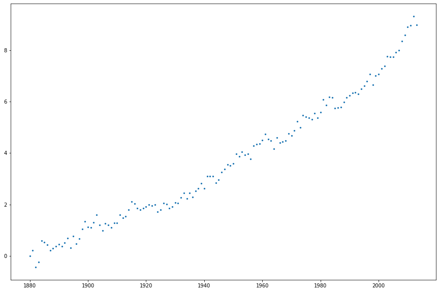
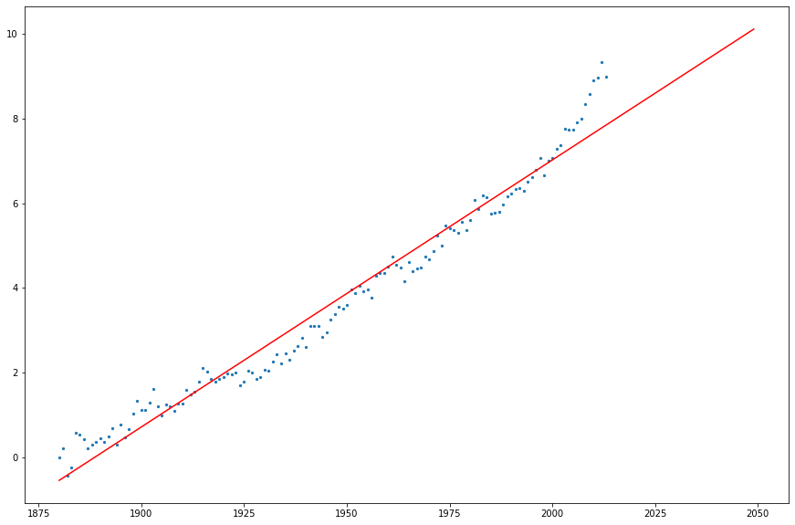
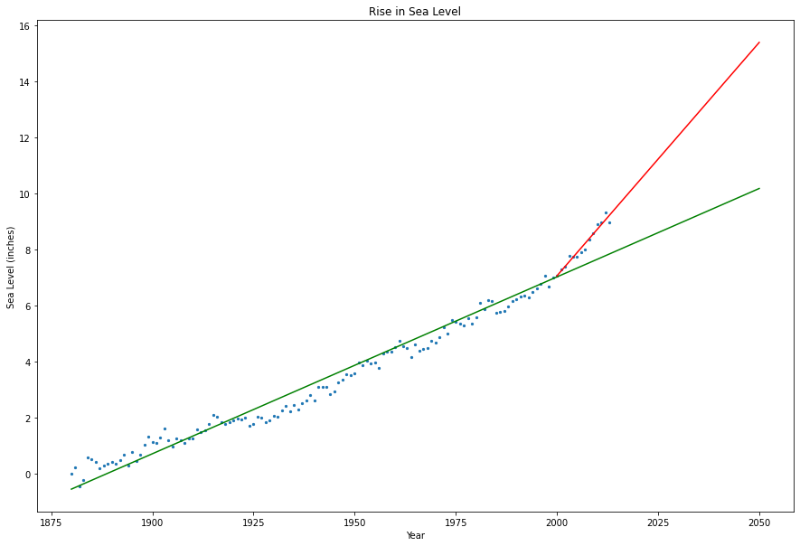

# Sea Level Predictor Walkthrough

### Import Modules


```python
import pandas as pd
import matplotlib.pyplot as plt
from scipy.stats import linregress
```

### Read Data into Dataframe


```python
df = pd.read_csv("epa-sea-level.csv")
df
```


<div>
<table border="1" class="dataframe">
  <thead>
    <tr style="text-align: right;">
      <th></th>
      <th>Year</th>
      <th>CSIRO Adjusted Sea Level</th>
      <th>Lower Error Bound</th>
      <th>Upper Error Bound</th>
      <th>NOAA Adjusted Sea Level</th>
    </tr>
  </thead>
  <tbody>
    <tr>
      <th>0</th>
      <td>1880</td>
      <td>0.000000</td>
      <td>-0.952756</td>
      <td>0.952756</td>
      <td>NaN</td>
    </tr>
    <tr>
      <th>1</th>
      <td>1881</td>
      <td>0.220472</td>
      <td>-0.732283</td>
      <td>1.173228</td>
      <td>NaN</td>
    </tr>
    <tr>
      <th>2</th>
      <td>1882</td>
      <td>-0.440945</td>
      <td>-1.346457</td>
      <td>0.464567</td>
      <td>NaN</td>
    </tr>
    <tr>
      <th>3</th>
      <td>1883</td>
      <td>-0.232283</td>
      <td>-1.129921</td>
      <td>0.665354</td>
      <td>NaN</td>
    </tr>
    <tr>
      <th>4</th>
      <td>1884</td>
      <td>0.590551</td>
      <td>-0.283465</td>
      <td>1.464567</td>
      <td>NaN</td>
    </tr>
    <tr>
      <th>...</th>
      <td>...</td>
      <td>...</td>
      <td>...</td>
      <td>...</td>
      <td>...</td>
    </tr>
    <tr>
      <th>129</th>
      <td>2009</td>
      <td>8.586614</td>
      <td>8.311024</td>
      <td>8.862205</td>
      <td>8.046354</td>
    </tr>
    <tr>
      <th>130</th>
      <td>2010</td>
      <td>8.901575</td>
      <td>8.618110</td>
      <td>9.185039</td>
      <td>8.122973</td>
    </tr>
    <tr>
      <th>131</th>
      <td>2011</td>
      <td>8.964567</td>
      <td>8.661417</td>
      <td>9.267717</td>
      <td>8.053065</td>
    </tr>
    <tr>
      <th>132</th>
      <td>2012</td>
      <td>9.326772</td>
      <td>8.992126</td>
      <td>9.661417</td>
      <td>8.457058</td>
    </tr>
    <tr>
      <th>133</th>
      <td>2013</td>
      <td>8.980315</td>
      <td>8.622047</td>
      <td>9.338583</td>
      <td>8.546648</td>
    </tr>
  </tbody>
</table>
<p>134 rows × 5 columns</p>
</div>


### Scatter Plot
#### Use matplotlib to create a scatter plot using the "Year" column as the x-axis and the "CSIRO Adjusted Sea Level" column as the y-axix.


```python
fig, ax = plt.subplots(figsize=(15, 10))
ax.scatter(df["Year"], df["CSIRO Adjusted Sea Level"], s=5)
```


    <matplotlib.collections.PathCollection at 0x7fb26fa76070>


    

    


### Use the linregress function from scipy.stats . . .

#### . . . to get the slope and y-intercept of the line of best fit. Plot the line of best fit over the top of the scatter plot. Make the line go through the year 2050 to predict the sea level rise in 2050.


```python
fig, ax = plt.subplots(figsize=(15, 10))
ax.scatter(df["Year"], df["CSIRO Adjusted Sea Level"], s=5)
years = list(range(1880, 2050))
res = linregress(df["Year"], df["CSIRO Adjusted Sea Level"])
line = [res.slope*i + res.intercept for i in years]
ax.plot(years, line, "r", label="Line")
```


    [<matplotlib.lines.Line2D at 0x7fb26f990ee0>]


    

    


#### Plot a new line of best fit just using the data from year 2000 through the most recent year in the dataset. Make the line also go through the year 2050 to predict the sea level rise in 2050 if the rate of rise continues as it has since the year 2000.


```python
fig, ax = plt.subplots(figsize=(15, 10))
ax.scatter(df["Year"], df["CSIRO Adjusted Sea Level"], s=5)
years = list(range(1880, 2051))
res = linregress(df["Year"], df["CSIRO Adjusted Sea Level"])
line = [res.slope*i + res.intercept for i in years]

years_later = list(range(2000, 2051))
df_later = df[df["Year"] >= 2000]
res_later = linregress(df_later["Year"], df_later["CSIRO Adjusted Sea Level"])
line_later = [res_later.slope*i + res_later.intercept for i in years_later]

ax.plot(years, line, "g", label="1880-2050")
ax.plot(years_later, line_later, "r", label="2000-2050")


# Set Labels
ax.set_xlabel("Year")
ax.set_ylabel("Sea Level (inches)")
ax.set_title("Rise in Sea Level")

```


    Text(0.5, 1.0, 'Rise in Sea Level')


    

    

